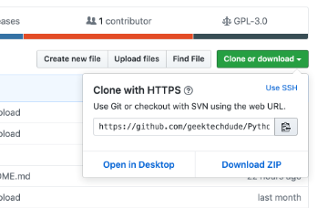

# PLC TO RPI SEND DATA VIA MODBUS

## `login `

# terminal / vscode remote device 

1. ssh wzero@w01

    password - wzero@admin

2. ADD user to sudo group on Ubuntu
    

## Prerequisites

- A system running a supported version of Ubuntu
- Access to a root user account or another account with sudo privileges
- Access to a terminal window/command line (Ctrl–Alt–T)
 
1. log into system with a root user or an account with  `sudo` privileges.

2. Open a terminal window and add a new user with the command:

         adduser newuser

The adduser command creates a new user, plus a group and home directory for that user.

You may get an error message that you have insufficient privileges. (This typically only happens for non-root users.) Get around it by entering:

    sudo adduser newuser

replace newuser with any username.then prompt you to enter a password. 

# note- 

> `RPI comport` - /dev/ttyUSB0

[link](https://forums.balena.io/t/read-from-serial-modbus-device/32680)

_________________________________________________________________

# GIT INSTALL VIA SSH-

1. sudo apt-get install git

2. git --version

3. git config --global user.name “`USERNAME`".

4. git config --global user.email “`EMAIL_ADDRESS`”

5. git clone

        git clone https://github.com/geektechdude/Python_PDF_Merge_Flask_Site.git
